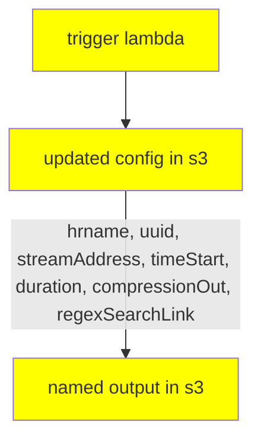

# aps-video-stream-capturing
This repo contains snippets and codes to capture, process and analyze online media streams.




```json
{
	"tip1":"nameOfStation"
	,"tip2":"cameraName"
}
```
ovanet_camera206

6ea07d73-53b8-494b-ae02-4676c9c95e97

## Trigger

`2022-07-12_13_04_43_cest` updatetime of the config

s3://aps-video-stream-capturing/

config/

config__ovanet_camera206__6ea07d73-53b8-494b-ae02-4676c9c95e97.json

config__ovanet_cameraxxx__2f82a624-2eda-44a0-9808-d855088186cf.json

## Output

s3://aps-video-stream-capturing/

captures/

ovanet_camera206__6ea07d73-53b8-494b-ae02-4676c9c95e97__2022-07-12_13_04_43_cest/

ovanet_camera206__6ea07d73-53b8-494b-ae02-4676c9c95e97__2022-07-12_13_04_43_cest.mp4


log/

ovanet_camera206__6ea07d73-53b8-494b-ae02-4676c9c95e97__2022-07-12_13_04_43_cest/

ovanet_camera206__6ea07d73-53b8-494b-ae02-4676c9c95e97__2022-07-12_13_04_43_cest.log
