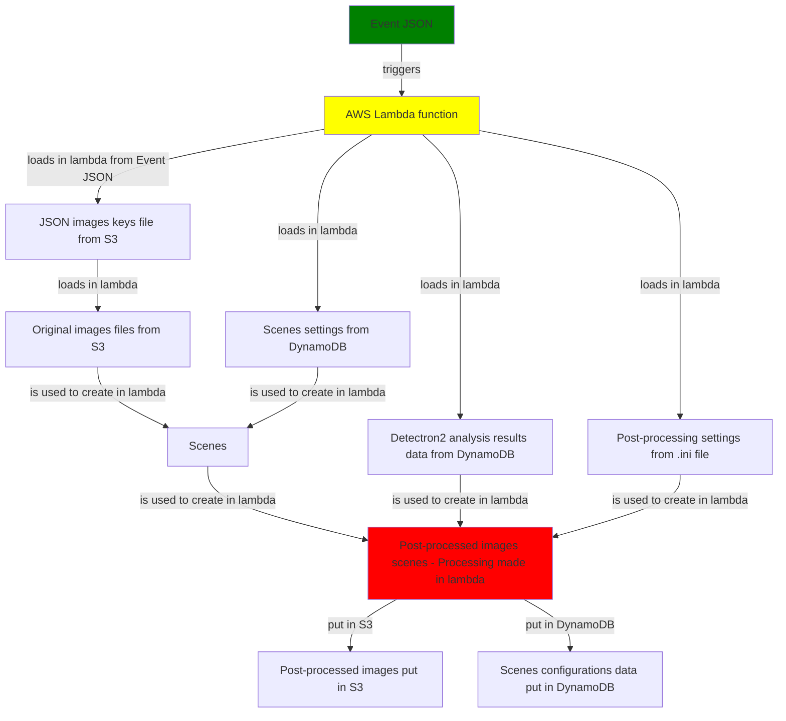

Antoine B.\
2022\
Supervised by Jiri Hylmar\
Debug python linux with visual studio code + wsl

***PROJECT IS CLOSED. DO NOT DEVELOP.***

# Small guidebook
https://docs.google.com/document/d/1LEP8Sfx-ZkadcA0jLwy_uYtQezeTmjVpOcHEXv55XAo

# Info
Lambda content has been exported from [lambda content](https://eu-west-1.console.aws.amazon.com/lambda/home?region=eu-west-1#/functions/imareg001?tab=configuration) and stored to [google drive project folder as zip](https://drive.google.com/drive/folders/1QLK3GOZfT-v3XIoj9YnC-hLw31uOKeig).

All files from  thislambda added to code commit [neu-imareg](https://eu-west-1.console.aws.amazon.com/codesuite/codecommit/repositories/neu-imareg/browse?region=eu-west-1); so code commit is synchronised (was not).

Further notes on history, source buckets, test images, etc. are inclured in [doc_image_registration](https://docs.google.com/document/d/14PtcfklRhjscOohbj1kpxhx60sv6_-a4EliKF0BIT8I/edit?usp=sharing)

Basic tests performed, code returns registered data with following notes.

# Authorisation method
added to code `boto3.setup_default_session(profile_name='JiHy_thw_npl_dat_tes')`

# Mission critical variables
local_script degub .png)

# Graphical device
[How to run graphical Linux applications on Windows 10 using the Windows Subsystem for Linux (WSL)](https://seanthegeek.net/234/graphical-linux-applications-bash-ubuntu-windows/#:~:text=Install%20VcXsrv&text=VcXsrv%20is%20the%20only%20fully,Accept%20the%20default%20options.
)

[test display](environment_testing/displayTest.py) simple test. Works, but menus in pop up do not show. 

This method not fitted for debuging in its pure form.
Operands, display ports behaviour need to be invistigated so it can be used.

# Issues

## PyLint not recognizing cv2 members

https://stackoverflow.com/questions/50612169/pylint-not-recognizing-cv2-members

pylint --generate-rcfile > .pylintrc

At the beginning of the generated .pylintrc file you will see
A comma-separated list of package or module names from where C extensions may be loaded. Extensions are loading into the active Python interpreter and may run arbitrary code.
`extension-pkg-whitelist=`  change to `extension-pkg-whitelist=cv2`

resulting to file [pylintrc](.pylintrc).

## Unused files
 > easy_install.py
 > requirements.txt
 > [json_maker](json_maker.py) to create artifical triggers in s3

# Image Postprocessing Workflow Diagram

# Conclusion

Code [local_script](local_script.py), which is a simplified version of [lambda_function](lambda_function.py), does not return errors. Issues come with x display (running on windows)

[dynamoParser](dynamoParser.py) read from db and [imareg](imareg.py) registration of image series which are mission critical programs seem to work.
